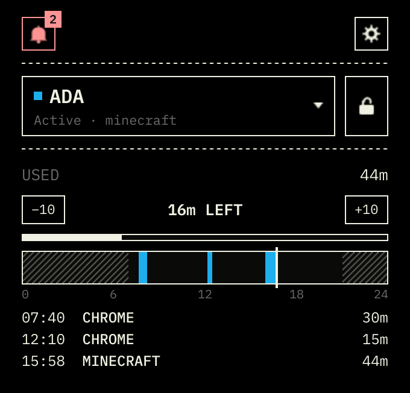
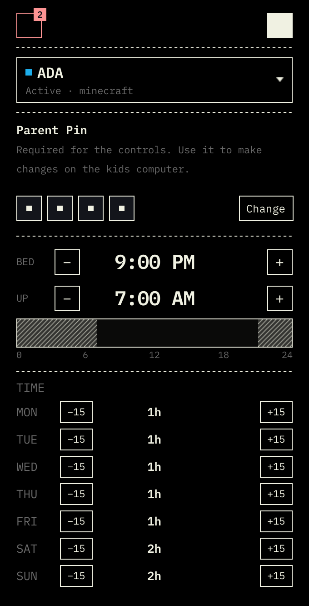
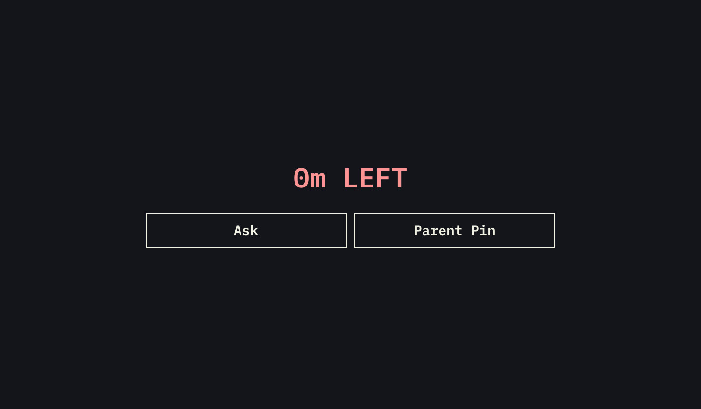
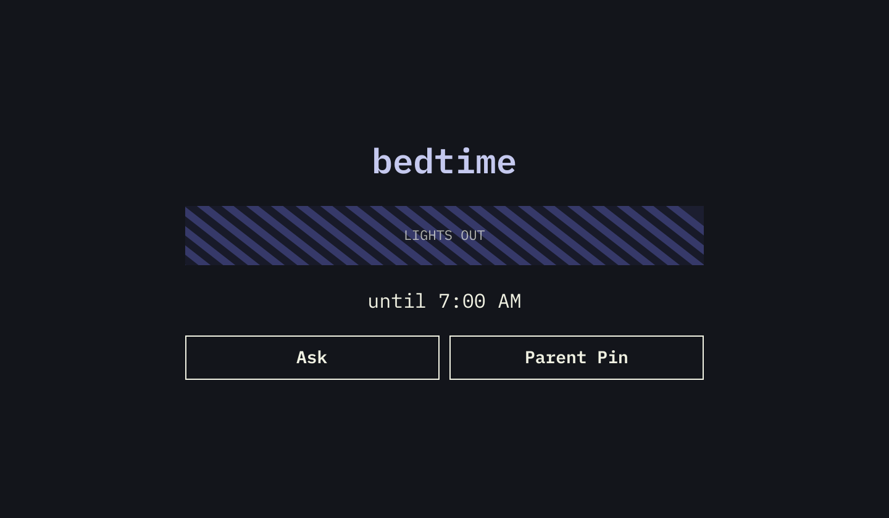
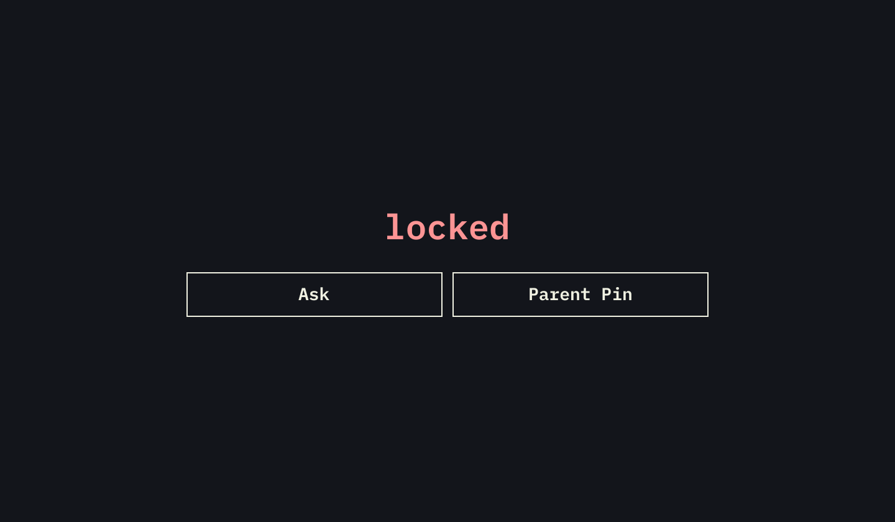
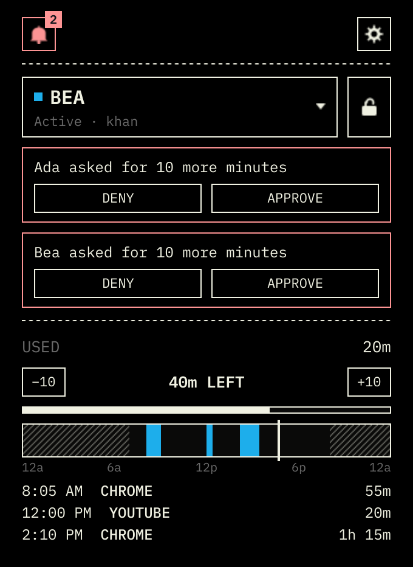
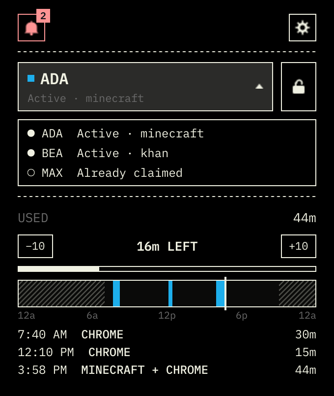
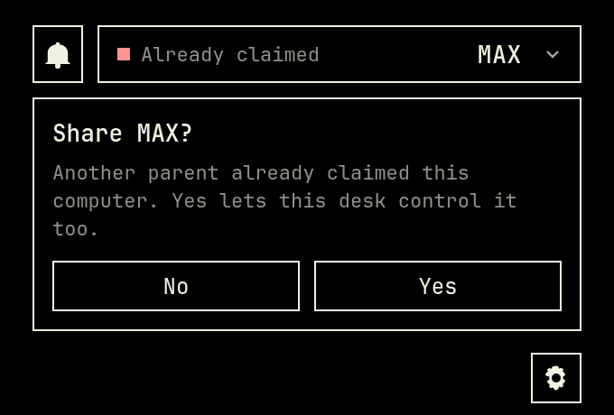

# Kidtimer

Kidtimer puts a daily time limit and a bedtime on a kid's Omarchy computer. You get a control panel on yours. When time runs out, bedtime begins, or you hit Lock from your desk, a full-screen overlay covers their session. Super and Escape will not get them out.

This is unofficial and not affiliated with Omarchy.

```
              +----------------+
              |     parent     |
              |  kid 1 · kid 2 |
              +--------+-------+
                       |
                  home Wi-Fi
                       |
          +------------+------------+
          |                         |
   +------+-----+            +------+-----+
   |   kid 1    |            |   kid 2    |
   | 47m left   |            |   1h left  |
   +------------+            +------------+
```



## Install

You need two Omarchy 4 computers on the same home network. A coffee-shop or open guest network is not enough. See [Limits](#limits).

Same plugin on both computers. Yours first, then theirs. No pairing codes.

1. Open a terminal with Super + Return.
2. Paste this:

```
omarchy plugin add https://github.com/adam-lagerhausen/omarchy-kidtimer.git --enable
```

3. Click the Kidtimer chip. Pick **This is mine**.
4. Sit at their computer. Same command. Click the chip. Pick **This is the kid's**. It will ask for your password so the timer can run in the background.

On yours, the tape waits until their computer shows up. Left-click the chip to open it. Right-click grants +10.

Set a 4-digit PIN next. Until one exists, time still counts but nothing covers their screen. The Lock square does nothing.

If you picked parent by mistake, open the chip and pick the kid's computer. It asks for the password again. A kid computer cannot switch to parent. Uninstall Kidtimer first, then pick again.

To update later: `omarchy plugin update kidtimer`. Kid computers you already claimed stay claimed, including if you came from Allowance.

## How it works

The panel shows time left, +10 and −10, Lock, and pending asks. Hours, bedtime, and CLOCK 12 or 24 live behind the gear. When they ask for more time, you get an Omarchy notification with their name. Approve or deny from the panel.

The log under the day is sittings: one stretch at the computer. Two apps in the same stretch share a row. `kidtimer parent export` prints every window.



Games and apps spend the hour. The bar, the launcher, idle time, and the session lock do not. Idle is about a minute with no keyboard or mouse, even if a game is still on the screen.

At midnight the clock refills from that day's hours. Extra time from yesterday does not stack.

### Defaults

The clock is already running: 1 hour Monday through Friday, 2 hours Saturday and Sunday, bedtime 9:00 PM to 7:00 AM. Those times follow the timezone in `/etc/kidtimer/config.toml` on the kid box. The installer leaves that as America/New_York. Change it if that is not your house.

### When time runs out

Time at zero, bedtime, and Lock from your desk all raise that overlay. It says 0m LEFT, bedtime, or locked.







It sits over a session that is still running. You are not looking at the Omarchy lock screen or the login screen. They tap Ask on that screen, or you add time from your desk or type the parent PIN on theirs.

### Asking for more

They tap Ask on their bar and pick minutes from 5 to 120, or Ask on the overlay and pick minutes with −10 / +10. They can ask during bedtime and a parent lock. Approve during the day adds the minutes they asked for. Approve during bedtime sets the timer to those minutes and lifts the bedtime overlay until they run out, then bedtime comes back. It does not lift a parent lock. A parent lock still needs Unlock or the parent PIN.



The parent PIN on the overlay adds minutes and clears a parent lock. During bedtime it works like an approved ask: it sets the timer to those minutes so the bedtime overlay lifts. When those minutes hit zero, bedtime comes back. The PIN does not change the scheduled hours or bedtime.

Five wrong guesses start a 30-second cooldown.

### Another desk, or a reinstall

If another parent already claimed a computer, it stays in the dropdown as Already claimed.



Click it if you mean to take over. Yes makes it yours. No leaves it in the list.



If you reinstall on yours, the kid computers you already claimed come back. You should not see an empty how-to.

### If you are not home

The kid computer keeps counting, and the overlay still works. Your desk needs the home network to see them, approve asks, grant +10 or −10, and lock. SSH into that desk and use the [command line](#command-line) if you are away from the screen.

## Command line

Install puts `kidtimer` in `~/.local/bin`. Run it from a terminal on your desk. The panel has to be up; these commands talk to it, not to the kid computer directly. Left-click the chip if you have not opened it yet.

With one kid computer connected, the commands pick it. With two, pass `-kid` and the name from the dropdown.

```
kidtimer pin set
kidtimer pin status
```

`pin set` asks twice. Same 4-digit PIN as the settings row. Until it exists, lock and the overlay do nothing.

```
kidtimer grant -minutes 10
kidtimer grant -minutes=-10
kidtimer lock
kidtimer unlock
kidtimer status
```

`grant -minutes 10` is the same as +10 on the panel. `-minutes=-10` takes ten minutes away. `status` prints JSON.

```
kidtimer asks
kidtimer decide <id> approve
kidtimer decide <id> deny
```

`asks` lists pending requests as JSON. Copy the `id` into `decide`.

```
kidtimer parent export
kidtimer parent export Ada
```

That prints every window from today: start time, what they were on, how long. The panel log folds those into sittings. Add `--json` for the raw list.

Two computers:

```
kidtimer grant -kid Ada -minutes 10
kidtimer lock -kid Ada
kidtimer parent export -kid Ada
```

`kidtimer` with no arguments lists the verbs. `kidtimer grant -h` and the others print flags.

## Limits

This is not a kiosk.

A kid who knows the computer password can stop it:

```
sudo systemctl stop kidtimer
```

If they kill the shell, the overlay is gone and Super works again. A TTY, a reboot, or Windows on a dual-boot disk all get them out. Time only counts while Omarchy is running.

The first desk the kid computer reaches is the one it talks to. Sit at yours first, then theirs. Keep guest laptops off Kidtimer until yours has claimed the box and the PIN is set.

Away from home the kid computer keeps counting, and the overlay still works. Your desk needs the home network to see them. SSH into that desk and use the [command line](#command-line) if you are away from the screen.

## Take it off

On each computer:

```
omarchy plugin remove kidtimer
```

On a kid computer, also:

```
sudo systemctl disable --now kidtimer
```

Leftovers that stay until you delete them:

- `/usr/local/bin/kidtimer`
- `/usr/local/share/kidtimer`
- `/etc/systemd/system/kidtimer.service`
- `/etc/kidtimer` and `/var/lib/kidtimer` on the kid box
- `~/.local/share/kidtimer` and `~/.local/bin/kidtimer`
- `~/.local/state/omarchy/indicators/stay-awake` if the overlay created it

## From source

You need Go 1.25.

```
git clone https://github.com/adam-lagerhausen/omarchy-kidtimer.git
cd omarchy-kidtimer
go test ./...
go build -o kidtimer ./daemon/cmd/kidtimer
```

`go test ./...` from the repo root must print PASS.

Then from that checkout, pick **This is mine** / **This is the kid's** on the chip, or run `helpers/apply-role.sh parent` on the parent desk. Kid setup asks for your password once and installs a root-owned binary under `/usr/local`.

`packaging/pack.sh` writes the tarballs and checks `packaging/SHA256SUMS`. `packaging/install.sh` is the unpack installer for those tarballs.

## License

The daemon is MIT. The text is in `LICENSE`. JetBrains Mono is OFL, not MIT. That text is in `fonts/OFL.txt`.

Report a lock bypass privately. See `SECURITY.md`.
